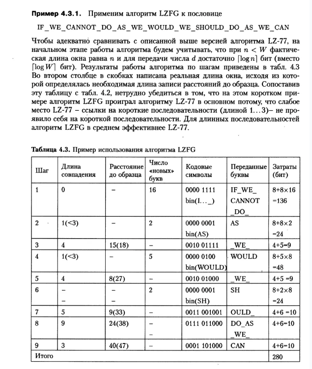

# LZFG Compressor

Репозиторий содержит рабочую реализацию алгоритма сжатия LZFG – модификации классического алгоритма LZ-77, используемого в архиваторах. Данный проект демонстрирует, как можно эффективно находить совпадения в скользящем словаре с использованием хеширования и оптимизированного кодирования, а также как наглядно представить процесс работы алгоритма в виде таблицы шагов.

## Об алгоритме

Алгоритм LZFG представляет собой улучшение LZ-77 с учётом следующих особенностей:
- **Скользящий словарь:** Для каждого нового символа алгоритм ищет в окне (размер которого может варьироваться от 2048 до 16384 символов, но для тестовых примеров может быть меньше) совпадающие последовательности.
- **Хеширование для 3-буквенных последовательностей:** Трёхбуквенные блоки обрабатываются как двоичные последовательности (24 бита), для которых вычисляется хеш-функция, отображающая их в 12-битные адреса ячеек памяти. Это позволяет быстро находить предыдущие вхождения и обновлять информацию о последнем появлении.
- **Кодирование ссылок и литералов:**  
  - Если найдено совпадение длиной **3 и более** символов, формируется ссылка с указанием длины совпадения (кодируется в 4 битах как _match_length - 2_) и расстояния до предыдущего вхождения (кодируется числом бит, равным ⎡log₂(текущий размер окна)⎤).
  - Если совпадение слишком короткое (1 или 2 символа), то такие символы передаются как литералы. Группа литералов кодируется: 4-битное поле для количества символов (сдвинутое на -1) и 8 бит на каждый символ.
- **Оптимизация:** При сжатии длинных последовательностей алгоритм LZFG показывает в среднем лучшую эффективность по сравнению с «прямолинейной» реализацией LZ-77, за счёт улучшенного кодирования и уменьшения избыточности.

## Как это работает

Запуская программу, вы увидите пошаговую таблицу, аналогичную Таблице 4.3 из учебных материалов, в которой для каждого шага отображаются:
- **Шаг:** порядковый номер операции.
- **Длина совпадения:** найденная длина последовательности в окне.
- **Расстояние до образца:** расстояние до предыдущего вхождения (с указанием текущего размера окна).
- **Число букв:** количество переданных литералов (если не найдено достаточное совпадение).
- **Кодовые символы:** сформированная кодовая комбинация (содержащая 4-битное поле для длины или литералов, а также битовое представление расстояния или букв).
- **Переданные буквы:** непосредственно передаваемый фрагмент исходной строки.
- **Затраты (бит):** суммарное количество бит, затраченных на данное кодирование.

